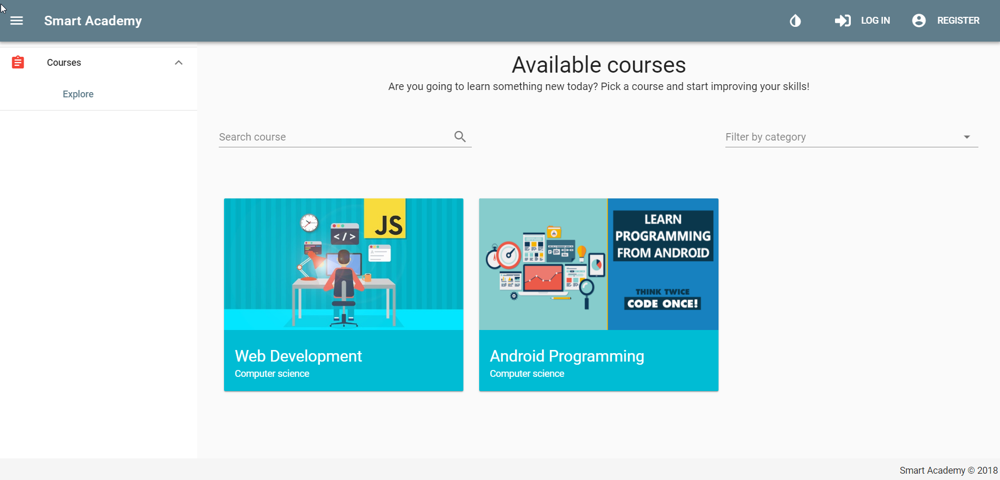
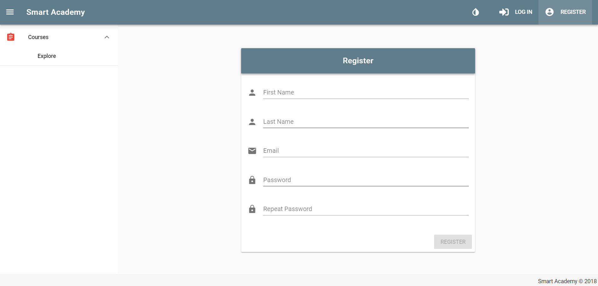
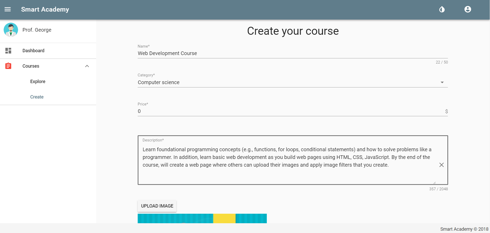
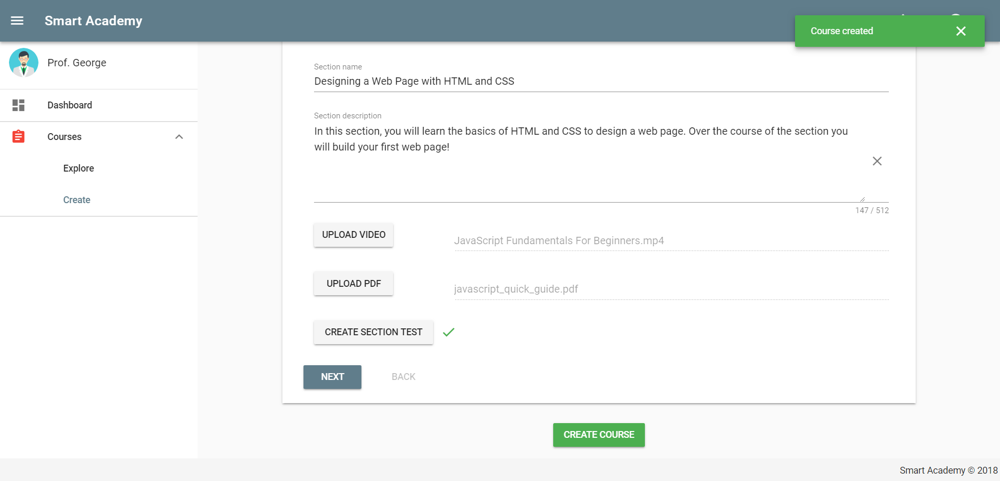
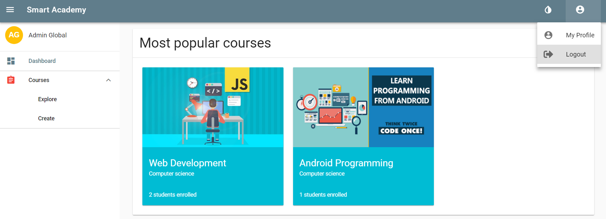
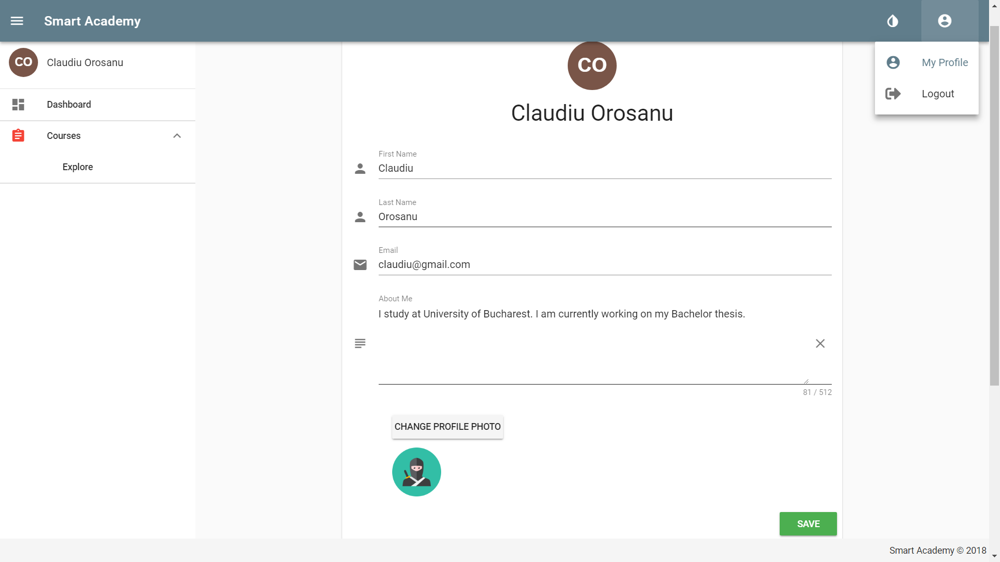
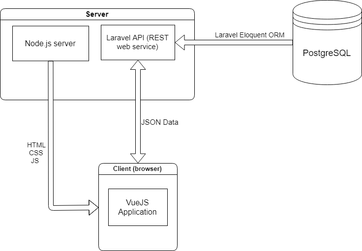
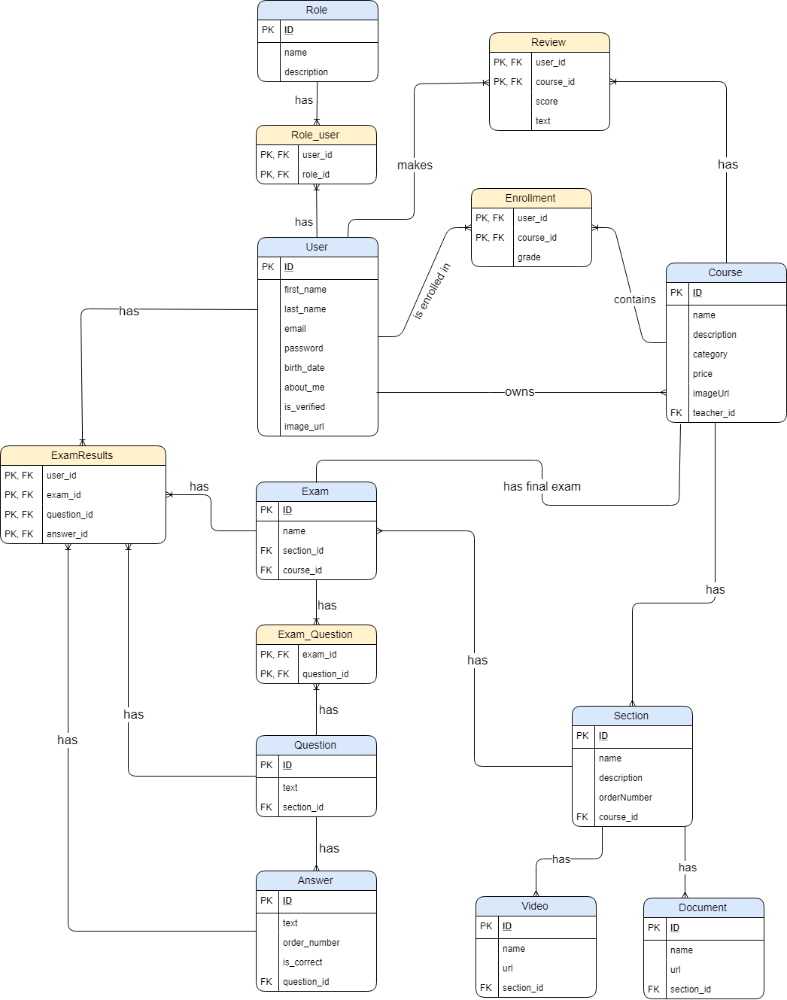

# SmartAcademy

Smart Academy is an e-learning platform that enables **students** to learn new things by enrolling in online courses. The courses are organized in sections, each section containing learning materials (documents and videos) and a multiple choice test. Courses are created by **professors**.

- [Screenshots](#screenshots)
    + [View courses as guest](#view-courses-as-guest)
    + [Register a new account](#register-a-new-account)
    + [View course details](#view-course-details)
    + [Create course as professor](#create-course-as-professor)
    + [Dashboard](#dashboard)
    + [User profile](#user-profile)
- [Architecture](#architecture)
- [ERD](#erd)

# Screenshots

## View courses as guest

## Register a new account

## View course details

## Create course as professor

## Dashboard

## User profile

---

# Architecture

---

# ERD

